# Tabla de Contenidos

- [1. Instalar y configurar Tomcat](#1-instalar-y-configurar-tomcat)
  - [1.1. Instalar Tomcat](#11-instalar-tomcat)
  - [1.2. Configurar Tomcat](#12-configurar-tomcat)
    - [1.2.1. Usuarios](#121-usuarios)
  - [1.3. VirtualHost en Tomcat](#13-virtualhost-en-tomcat)
    - [1.3.1. webapps](#131-webapps)
    - [1.3.2. server.xml](#132-serverxml)
    - [1.3.3. Crear el subdominio](#133-crear-el-subdominio)
    - [1.3.4. Registro tipo A](#134-registro-tipo-a)
    - [1.3.5. Volvemos al server.xml](#135-volvemos-al-serverxml)
    - [1.3.6. Propietarios](#136-propietarios)
  - [1.4. Subir la app](#14-subir-la-app)
- [2. EXTRA. ¿Cómo hacer un proyecto en VS y exportarlo a .war?](#2-extra-cómo-hacer-un-proyecto-en-vs-y-exportarlo-a-war)
  - [2.1. Extensión en VS](#21-extensión-en-vs)
  - [2.2. Crear el proyecto en JSP](#22-crear-el-proyecto-en-jsp)
  - [2.3. Exportar el proyecto](#23-exportar-el-proyecto)
    - [2.3.1. Instalar Maven](#231-instalar-maven)
    - [2.3.2. Descompresión del zip y ubicación](#232-descompresión-del-zip-y-ubicación)
    - [2.3.3. Variable de entorno Path](#233-variable-de-entorno-path)
    - [2.3.4. Variable de entorno Maven](#234-variable-de-entorno-maven)
    - [2.3.5. Comprobación final](#235-comprobación-final)
  - [2.4. Comando final](#24-comando-final)
- [3. Despliegue del proyecto de maven en JSP](#3-despliegue-del-proyecto-de-maven-en-jsp)
  - [3.1. Subir el proyecto](#31-subir-el-proyecto)
  - [3.2. Autodescompresión](#32-autodescompresión)
  - [3.3. Colocar el proyecto en su carpeta](#33-colocar-el-proyecto-en-su-carpeta)
  - [3.4. Propietarios](#34-propietarios)
  - [3.5. Resultado en navegador](#35-resultado-en-navegador)
- [4. Nginx Proxy](#4-nginx-proxy)
  - [4.1. Netstat](#41-netstat)
  - [4.2. Server block](#42-server-block)
    - [Resumen server block](#resumen-server-block)
  - [4.3. Creamos el subdominio](#43-creamos-el-subdominio)
  - [4.4. Cerrar puerto y resetear](#44-cerrar-puerto-y-resetear)
    - [Preguntas de Examen](#preguntas-de-examen)

# 1. Instalar y configurar Tomcat

**Nota**: Para el primer objetivo de Tomcat, he usado el puerto 8079 (porque en la red del instituto tienen bloqueado el puerto 8080), pero el puerto más comunmente usado para el Tomcat es el 8080.

## 1.1. Instalar Tomcat

Para instalar Tomcat y llegar a ver el Tomcat Manager en el navegador, he seguido esta guía, hasta el paso número 4 (no incluído) 

https://techviewleo.com/install-tomcat-on-amazon-linux/

Video Extra: https://www.youtube.com/watch?v=SMQjlcRmgiM

**Nota**: Después de seguir la guía, en el momento final de probar a ver el Tomcat Manager en el Chrome, no me salía … por qué??

Resulta que, aunque había abierto un puerto (8079) para el Tomcat a través de AWS, y cambiado el puerto también (8079) dentro del archivo de configuración del Tomcat de server.xml…

`sudo vi usr/share/apache-tomcat-9.0.39/conf/server.xml`


pues aún así, en el navegador, al poner IP:8079 seguía sin funcionarme…
Y todo era porque, de entre todas las cosas que ya llevaba hechas de antemano, resulta que el servicio del firewalld estaba activo !!! y no debería de estarlo !!

Entonces el firewalld estaba interfiriendo con el firewall de AWS …

`sudo systemctl stop firewalld`

`sudo systemctl disable firewalld`

Ahora voy al navegador a poner IP (o dominio):8079 y puedo ver el Tomcat Manager perfectamente.


Video Extra: https://www.youtube.com/watch?v=mBVINWl-AWo&ab_channel=LDTS

## 1.2. Configurar Tomcat

### 1.2.1. Usuarios

Empezamos creando los usuarios necesarios para entrar en Tomcat Manager.

Para ello, retomamos la guía de antes del Tomcat a partir del punto 4

https://techviewleo.com/install-tomcat-on-amazon-linux/

Abrimos el archivo de:

`vi usr/share/apache-tomcat-9.0.39/conf/tomcat-users.xml`

Añadimos al final:

```
<role rolename="admin-gui"/>
<role rolename="manager-gui"/>
<user username="tomcat" password="tupassword" fullName="Administrator"
roles="admin-gui,manager-gui"/>
```

`sudo systemctl restart tomcat`

**Nota**: esto que hemos hecho no es obligatorio hacerlo ahora ya que esto sería para entrar en el gestor de Tomcat...

Si me diese algún error Tomcat Manager en lo que hemos hecho hasta ahora …

Abrir el archivo de configuración de Tomcat de:

`vi usr/share/apache-tomcat-9.0.39/webapps/manager/META-INF/context.xml`

En él, comentaremos las líneas que hacen que sólo se pueda acceder al Tomcat Manager por localhost…

## 1.3. VirtualHost en Tomcat

### 1.3.1. webapps

Hacemos una copia a la carpeta webapps y le cambiamos el nombre

`sudo cp -rf usr/share/apache-tomcat-9.0.39/webapps/usr/share/apache-tomcat-9.0.39/webPrueba1`

### 1.3.2. server.xml

Ahora vamos al archivo de configuración de Tomcat de server.xml

`sudo vi usr/share/apache-tomcat-9.0.39/conf/server.xml`

y buscamos el siguiente bloque:


Esto es equivalente a un VirtualHost de Apache web server, o a un Server Block de Nginx (ver apartado siguiente). 

Por tanto, lo que tenemos que hacer es añadir otra sección Host nueva, de forma que tendremos 2 Host... equivalentes a dos VirtualHost de Apache...

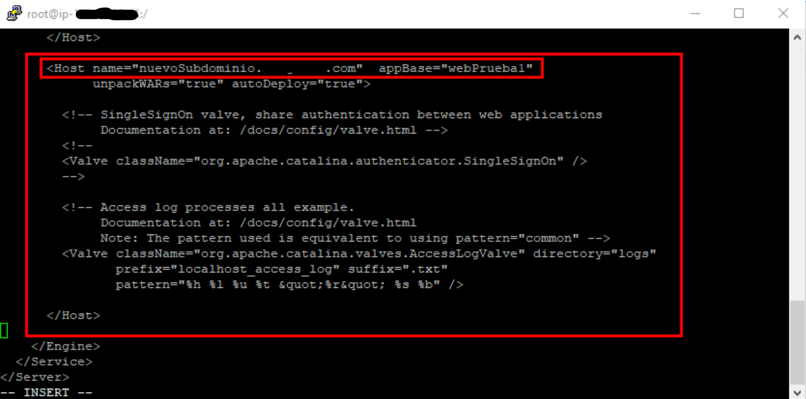

… donde webPrueba1 es el directorio que copiamos antes y seria nuestro nuevo document root (lo que en Apache equivaldría al DocumentRoot).

### 1.3.3. Crear el subdominio

Ahora vamos a IONOS para crear un nuevo subdominio (de la misma forma que creamos el del wordpress… wp.tudominio.com)


**Nota**: como ya comentaba en el objetivo anterior, antes de empezar con los objetivos, es decir, preparando la asignatura tal como la dejamos el año pasado, cometí el error de crear un subdominio para el portfolio, pero eso ya lo corregí, poniendo el portfolio en mi dominio principal, de modo he retocado un poco esta imagen para que se vea bien.

**Nota**: lo de que mi dominio no está en uso, también comenté en el readme principal del repositorio, que fue porque al principio, cuando fui a enlazar mi dominio con un servername (registro dns tipo A) en Ionos, en vez de poner el caracter @ (que significa "este dominio mismo") puse la triple w... cosa que estuvo mal y no es necesaria, así que ustedes deben poner el servername del registro dns tipo A de su dominio como un caracter @... y de esa manera ya si está bien asociado el dominio y sí aparece en Ionos el mensaje de que sí está el dominio en uso.

**Nota**: como también comentaba en el objetivo anterior del nginx, sobre el subdominio y serverblock del wordpress, es posible que en algunas imágenes de los tres primeros objetivos (nginx-tomcat-apacheSSL) aparezcan alternados los nombres de wordpress y wp para el subdominio y serverblock del wordpress.

### 1.3.4. Registro tipo A

Ahora tenemos que añadirle a este subdominio el registro tipo A que apunta a mi IP

**Nota**: pero primero, desactivamos el Registro A que ya viene predeterminado con la creación del subdominio

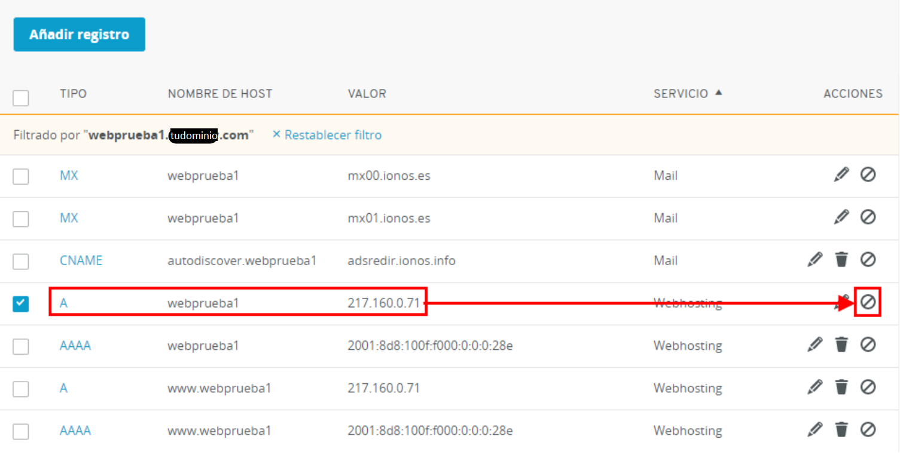


### 1.3.5. Volvemos al server.xml

Tenemos que poner bien el nuevo (server)name

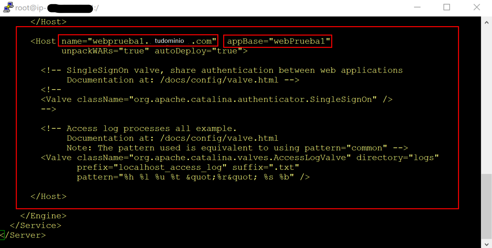

### 1.3.6. Propietarios

Y por último, cambiamos el propietario de la carpeta webPrueba1 y comprobamos los permisos:

`chown -R tomcat:tomcat usr/share/apache-tomcat-9.0.39/webPrueba1/`

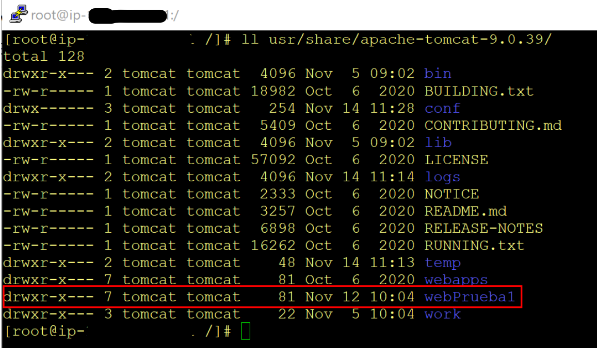


## 1.4. Subir la app

Una vez hecho esto solo nos queda ir al directorio webPrueba1 y poner en el Root lo que vamos a desplegar, hacer un reseteo del tomcat con `systemctl restart tomcat`, e ir al navegador y poner en la URL `webprueba1.tudominio.com:8079` para comprobar que funciona perfectamente.

Otra posibilidad sería entrar al tomcat manager (dns:8079) y subir la aplicación en .war.

Video Extra: https://www.youtube.com/watch?v=PXozxgEMVss&ab_channel=LDTS

# 2. EXTRA. ¿Cómo hacer un proyecto de Maven en JSP en VS y exportarlo a .war?

Para reforzar lo aprendido, voy a realizar los mismos pasos para desplegar un proyecto en Tomcat, pero esta vez, creando un proyecto de maven en JSP con un nuevo subdominio (webprueba2.tudominio.com)

## 2.1. Extensión en VS

Vamos a Visual Studio y en el apartado de las extensiones, buscamos la de Extension Pack for Java y la instalamos

**Nota**: esta extensión es como la recopilación a su vez, de más extensiones de visual studio para este propósito de desarrollo, es decir, con esta extensión, también tendremos como instaladas y habilitadas otras extensiones como, Project Manager For Java o Maven For Java …

Importante: Es necesario instalar/tener instalado, un jdk (el jdk más actual)

https://www.oracle.com/es/java/technologies/javase/javase8-archive-downloads.html

En mi caso, como versión de java principal en mi sistema tengo el jre1.8.0_311, y he instalado el jdk1.8.0_202

Curiosidad: El jdk1.8.0_202, también me instaló a su compañero el jre1.8.0_202, pero si hago en el cmd el comando java -version, lo que me sale como versión principal de java en mi sistema es el jre1.8.0_311 el cual era el que yo ya tenía en mi sistema, y que es más actual aún que el jre compañero que me ha venido del jdk1.8.0_202 … ¿cómo se explica esto, si en la variable de sistema JAVA_HOME la tengo apuntando a la carpeta del jdk1.8.0_202?

## 2.2. Crear el proyecto en JSP

Para crear un proyecto de Maven en JSP…

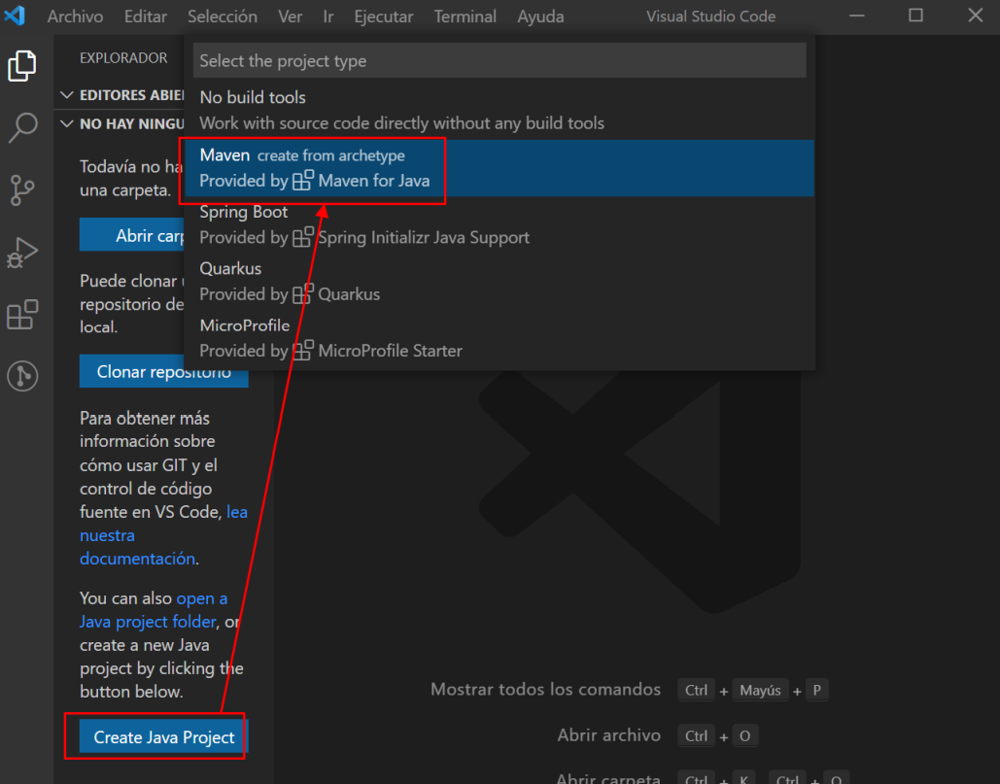

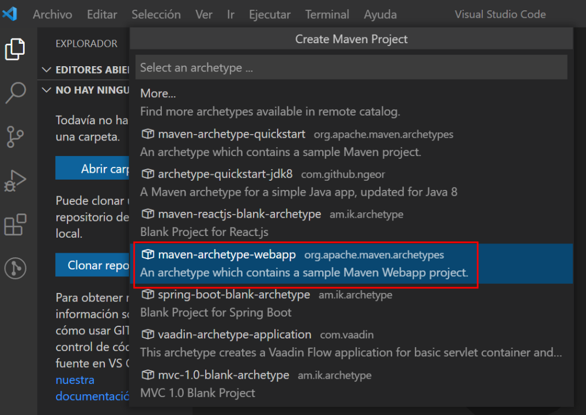


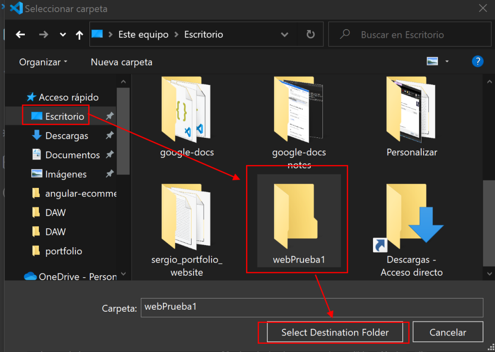


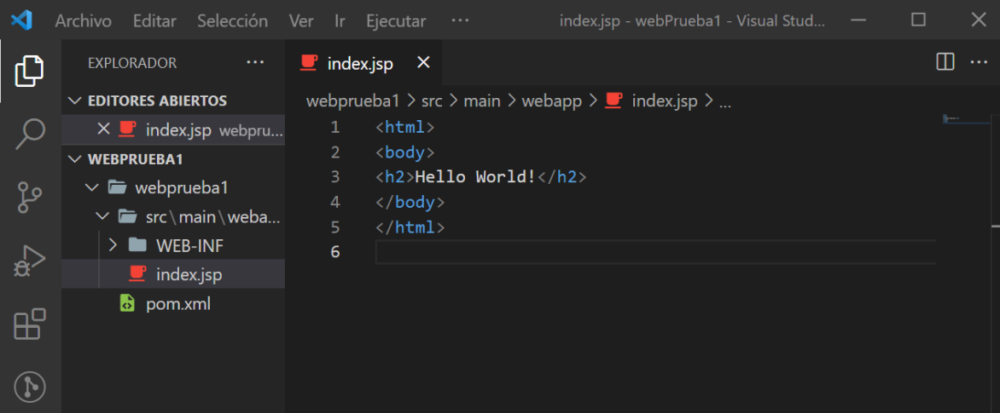

## 2.3. Exportar el proyecto

Para exportar el proyecto a un archivo .war … ¡ Antes tenemos que instalar Maven !

### 2.3.1. Instalar Maven

Para instalar maven, vamos a la web de maven apache project y descargamos el Binary zip archive

https://maven.apache.org/download.cgi

y seguimos esta guía:

https://www.youtube.com/watch?v=km3tLti4TCM&ab_channel=AmitThinks

### 2.3.2. Descompresión del zip y ubicación

Descomprimimos el archivo zip y llevamos la carpeta resultante a Program Files, y nos metemos dentro de ella, dentro de bin, y copiamos su ruta

### 2.3.3. Variable de entorno Path

Ahora vamos a las variables de entorno del sistema, para editar el path del sistema y añadirle una nueva ruta que es la que habíamos copiado

### 2.3.4. Variable de entorno Maven

Ahora vamos a crear una variable de sistema llamada MAVEN_HOME y le pegamos la ruta de antes pero sin el \bin, y ponemos ésta justa debajo del JAVA_HOME

### 2.3.5. Comprobación final

Si en el cmd hacemos el comando mvn --version (ó -v) podremos comprobar que ya lo tenemos instalado correctamente


## 2.4. Comando final

Una vez que tenemos ya nuestra proyecto listo, desde la terminal de VS ejecutamos el comando de maven para compilar en .war

`mvn clean package`

y se nos guardará el proyecto.war en la carpeta de Target.

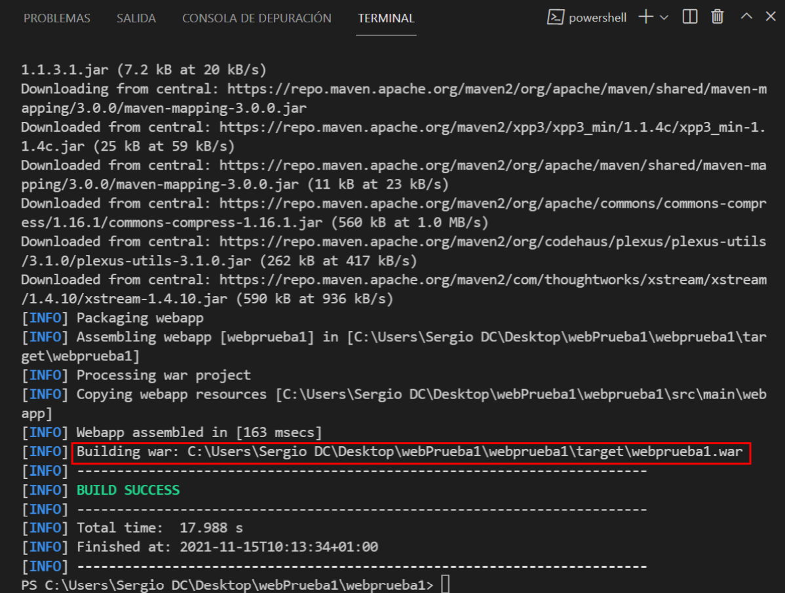

# 3. Despliegue del proyecto de maven en JSP

## 3.1. Subir el proyecto

Subimos el proyecto.war con Filezilla al servidor de AWS

## 3.2. Autodescompresión

Lo movemos hacia dentro de la carpeta de webapps para que se auto-descomprima el .war

`mv proyecto.war /usr/share/apache-tomcat-9.0.39/webapps/`

## 3.3. Colocar el proyecto en su carpeta

Una vez descomprimido, eliminamos el .war y llevamos la carpeta resultante a su carpeta correspondiente la cual ya habíamos creado de antes

`mv proyecto /usr/share/apache-tomcat-9.0.39/webPrueba1/`

**Nota**: Antes de mover todo lo que hay dentro de /usr/share/apache-tomcat-9.0.39/webPrueba1/proyecto/ hacia /usr/share/apache-tomcat-9.0.39/webPrueba1/ROOT/ debemos eliminar en esa carpeta de ROOT/ todos los archivos los cuales sus nombres coincidan de antemano con alguno de los nuestros, de la carpeta proyecto/ (por si no se sobreescriben, que no se entorpezcan los unos con otros)

Movemos el contenido de /usr/share/apache-tomcat-9.0.39/webPrueba1/proyecto/ hacia /usr/share/apache-tomcat-9.0.39/webPrueba1/ROOT/

## 3.5. Propietarios

Cambiamos los propietarios de forma recursiva para Tomcat

`chown -R tomcat:tomcat /usr/share/apache-tomcat-9.0.39/webPrueba1/`

Reseteamos tomcat

`systemctl restart tomcat`

## 3.6. Resultado en navegador

Vamos al navegador y ponemos webprueba1.tudominio.com:8079

y funciona !!!

# 4. Nginx Proxy

Esta parte trata sobre cómo hacer que un servicio escuche a través de otro servicio (pareciendo que dos servicios escuchan por el mismo puerto). 

Debemos hacer que Tomcat escuche a través de Nginx (puerto 80) y después para asegurarnos, eliminaremos el puerto 8079 del grupo de segurrar de AWS, que previamente habíamos abierto y utilizado para el primer objetivo.

## 4.1. Netstat

Para ver qué puertos están escuchando usamos el netstat:

`nestat -ntl`

`netstat -ntlp`

`netstat -n4a`

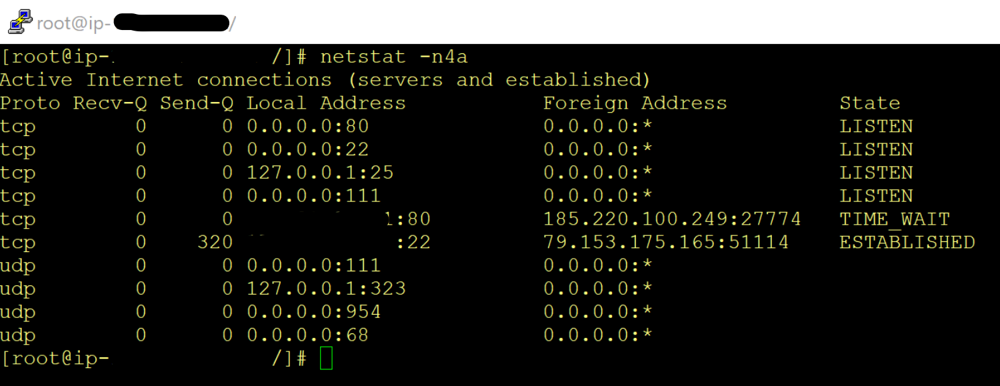

## 4.2. Server block

Creamos un nuevo server block para Nginx

`vi etc/nginx/conf.d/webprueba2.conf`

```
server {
  listen 80;
  server_name webprueba2.tudominio.com;
  # note that these lines are originally from the "location /"block
  #root /usr/share/nginx/html/portfolio;
  #index index.php index.html index.htm;
  #location / {
    #try_files $uri $uri/ =404;
  #}
  error_page 404 /404.html;
  error_page 500 502 503 504 /50x.html;
  location = /50x.html {
    root /usr/share/nginx/html;
  }
  location ~ \.php$ {
    try_files $uri =404;
    fastcgi_pass unix:/var/run/php-fpm/php-fpm.sock;
    fastcgi_index index.php;
    fastcgi_param SCRIPT_FILENAME $document_root$fastcgi_script_name;
    include fastcgi_params;
  }
  location / {
    #proxy_pass http://127.0.0.1:8079;
    #proxy_pass http://tuip:8079;
    proxy_pass http://webprueba2.tudominio.com:8079;
  }
}
```

**Nota**: podemos apreciar que este server block NO tiene DocumentRoot, si no un nuevo location/ que redirige al subdominio de webprueba2.tudomninio.com

Curiosidad: tanto si redirecciono con el proxy_pass al localhost(127.0.0.1) como a mi IP pública (tu ip), se redirige al Tomcat Manager, así que necesito poner en el proxy_pass el subdominio:8079 para que realmente se vaya al subdominio webprueba2.tudominio.com

Curiosidad: También puedo hacer que se vea en weprueba2.tudominio.com mi proyecto de maven en JSP, y que si pongo weprueba2.tudoninio.com:8079 salga el webprueba1 … Esto se conseguiría si en el server block de webprueba2.tudominio.com.conf en la parte de arriba de servername pongo webprueba2.tudominio.com, y en la parte de abajo del proxy_pass pongo webprueba1.tudominio.com:8079

**Nota**: Para asegurarnos de que el proxy_pass (redireccionamiento de escucha) efectivamente está funcionando, debemos cerrar (eliminar en AWS) el puerto 8079 (o el que se hubiera utilizado para el primer objetivo del tomcat)

### Resumen server block

```
server {
  listen 80;
  server_name webprueba2.tudominio.com;

  location / {
    proxy_pass http://127.0.0.1:8079;
  }
}
```

## 4.3. Creamos el subdominio

Volvemos un momento a Ionos para crear el subdominio correspondiente, el de `webprueba2.tudominio.com`, y asociarlo a nuestra instancia apuntando a nuestra ip.


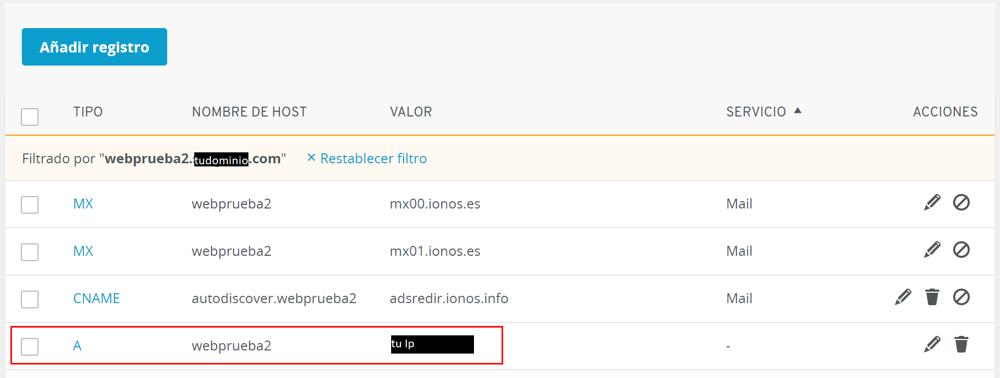

## 4.4. Cerrar puerto y resetear

Por último, como ya terminamos comentando antes, en AWS vamos al grupo de seguridad de nuestra instancia para cerrar el antiguo puerto del Tomcat (el 8079 o 8080, o cual sea en tu caso)


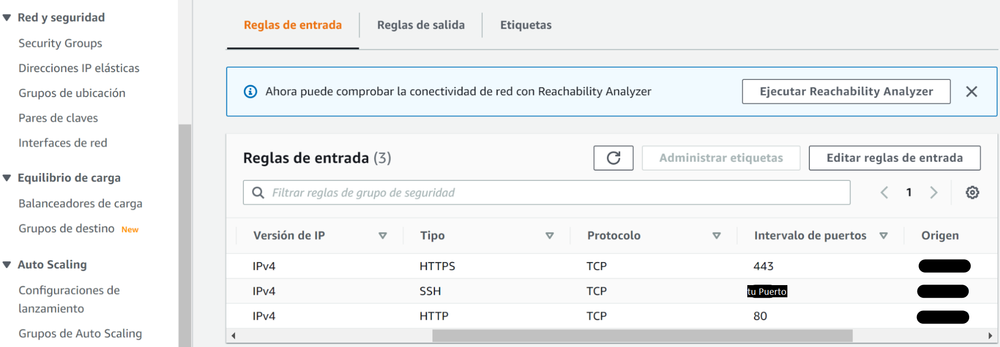

Posteriormente, dentro del servidor, resetamos Tomcat y Nginx con systemctl restart.

Y si ahora vamos al Chrome, y ponemos webprueba2.tudominio.com , podremos ver nuestro proyecto desplegado en Tomcat pero siendo Nginx quien nos lo muestra... y sin necesidad de poner el puerto al final de la URL.

### Preguntas de Examen

> P: ¿Qué es Tomcat?

> R: Apache Tomcat, es una opción reconocida entre los desarrolladores web para crear y mantener webs dinámicas y aplicaciones basadas en Java. Puedes utilizar Tomcat como contenedor de servlets para compilar y ejecutar aplicaciones web realizadas en Java, además de como servidor web autónomo en entornos con alto nivel de tráfico y alta disponibilidad.

Tomcat, también llamado Apache Tomcat o Jakarta Tomcat es un contenedor open source de servlets para la implementación de Java Servlet, JavaServer Pages (JSP), Java Expression Language y Java WebSocket. Las especificaciones de estos son desarrolladas bajo el Java Community Process.

Existe una confusión de conceptos entre Apache Tomcat y Apache, esto se debe a que coloquialmente al servidor Apache HTTP se le conoce como Apache. Tanto Tomcat como Apache HTTP son proyectos de Apache Software Foundation, cada uno implementado en un lenguaje diferente, Apache Tomcat en Java y Apache HTTP en C y XML. Aunque la diferencia fundamental es que el objetivo de Tomcat es servir específicamente aplicaciones Java, mientras que Apache es un servidor HTTP de propósito general.

> P: ¿Cómo funciona Tomcat?

> R: Tomcat puede definirse como servidor web por sí mismo, aunque normalmente se utiliza en combinación con otros productos por ejemplo Apache, para mejorar su soporte y realzar sus características. Tomcat puede ejecutar servlets y Java Server Pages (JSP). Al haber sido escrito en Java, funciona en cualquier sistema operativo que disponga de la máquina virtual Java.

> P: ¿Qué es el Nginx Proxy?

> R: Un proxy inverso se ubica frente a un servidor web y recibe todas las solicitudes antes de que lleguen al servidor de origen. Funciona de manera similar a un proxy de reenvío, con la excepción de que en este caso es el servidor web el que utiliza el proxy y no el usuario o el cliente. Los proxies inversos se utilizan normalmente para mejorar el rendimiento, la seguridad y la fiabilidad del servidor web.

Por ejemplo, puedes tener un sitio, que no usa WordPress, alojado en el dominio example.com del servidor A y tener tu blog en WordPress en la URL example.com/blog alojada en el servidor B. Puedes lograrlo añadiendo un proxy inverso para el servidor que aloja tu sitio principal. Puedes configurar el proxy inverso para redirigir las solicitudes del blog a un servidor diferente.

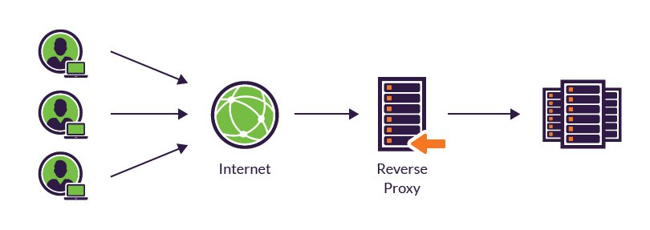

> P: ¿Diferencias entre proxy inverso y proxy de reenvío?

> R: Un servidor proxy inverso actúa como una fachada para que el servidor de origen mantenga el anonimato y mejore la seguridad, al igual que un usuario/cliente puede utilizar un proxy de reenvío para lograr lo mismo. Garantiza que ningún usuario o cliente se comunique directamente con el servidor de origen.

Proxy de Reenvío:


Proxy inverso:
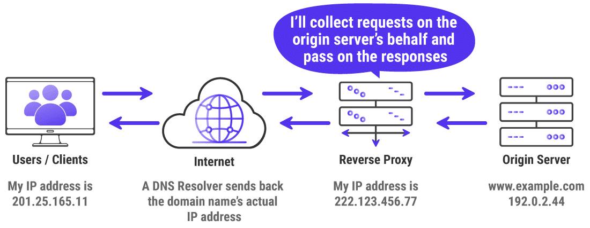

La diferencia entre un proxy de reenvío y un proxy inverso es menor, pero funcionan de manera diferente. Ambos pueden trabajar juntos, ya que no hay superposición en su funcionamiento. Normalmente, los usuarios/clientes utilizan un proxy de reenvío, mientras que los servidores de origen utilizan un proxy inverso.

Proxy de Reenvío vs. Proxy Inverso:


> P: ¿Beneficios de utilizar el Nginx Proxy?

> R: Algunas de sus principales ventajas son:

- Balancear la carga
- Equilibrio de Carga de Servidor Global (Global Server Load Balancing – GSLB)
- Seguridad mejorada
- Potente Caching
- Compresión superior
- Cifrado SSL optimizado
- Mejores pruebas A/B
- Monitoreo y registro del tráfico

Enlace extra de interés: https://docs.nginx.com/nginx/admin-guide/web-server/reverse-proxy/

## GNU Free Documentation License

Copyright (C)  2022  Sergio Díaz Campos.
    Permission is granted to copy, distribute and/or modify this document
    under the terms of the GNU Free Documentation License, Version 1.3
    or any later version published by the Free Software Foundation;
    with no Invariant Sections, no Front-Cover Texts, and no Back-Cover Texts.
    A copy of the license is included in the section entitled "GNU
    Free Documentation License".
