# HTTPS con Apache y OpenSSL

# 1. Autoridad Certificadora

Para empezar a documentarme un poco sobre todo este tema, voy a leer y a comparar estas guías que he encontrado, y después elegiré la mejor para seguirla y hacer esta parte.

### Tutorial: configure SSl/TLS en Amazon Linux 2

https://docs.aws.amazon.com/es_es/AWSEC2/latest/UserGuide/SSL-on-amazon-linux-2.html

### Cómo crear un certificado SSL autofirmado para Apache en Ubuntu 20.04

https://www.digitalocean.com/community/tutorials/how-to-create-a-self-signed-ssl-certificate-for-apache-in-ubuntu-20-04-es

### Crear autoridad certificadora (CA) y certificados autofirmados en Linux

https://blog.guillen.io/2018/09/29/crear-autoridad-certificadora-ca-y-certificados-autofirmados-en-linux/

### Habilitar SSL en la instancia de Apache en EC2

https://www.it-swarm-es.com/es/apache/habilitar-ssl-en-la-instancia-de-apache-en-ec2/940599307/

## 1.1. Habilitar Apache

Como en toda esta parte volveré a usar el Apache, lo primero de todo será parar y deshabilitar nginx para que no entre en conflicto con apache

`systemctl stop nginx`

`systemctl disable nginx`

`systemctl start httpd`

`systemctl enable httpd`

## 1.2. Grupo de seguridad

Vamos a abrir un nuevo puerto para el SSl en Apache en el Security Group de AWS

## 1.3. Crear la CA

Vamos a crear la CA en la ruta etc/httpd/conf.d/

Así que primero vamos hacia dentro de esa ruta...

`openssl req -x509 -newkey rsa:2048 -keyout AutoridadCertificadora.key -days 365 -out AutoridadCertificadora.crt`

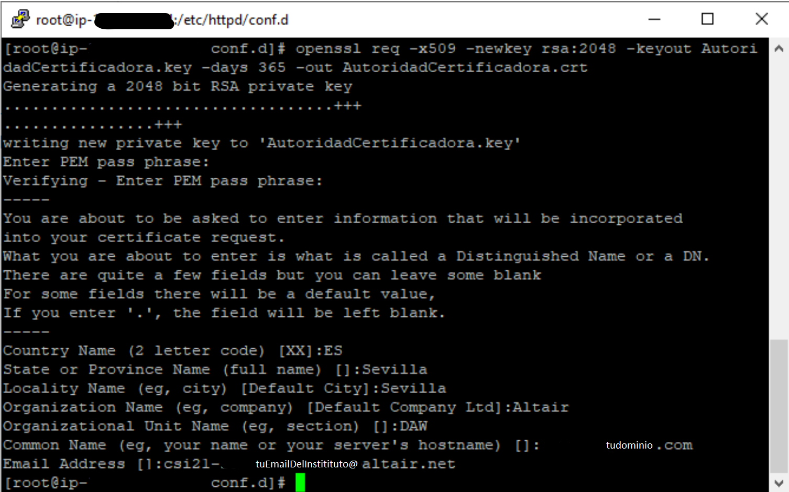

PEM pass phrase: tupassword

# 2. Certificado de Dominio

## 2.1. Solicitud de certificado

Vamos a crear una SOLICITUD de certificado (no el certificado en sí).

Nota: Recordar que seguimos en el directorio de configuración de Nginx

`openssl req -new -keyout ApacheSSL.key -out SolicitudApacheSSL.csr`

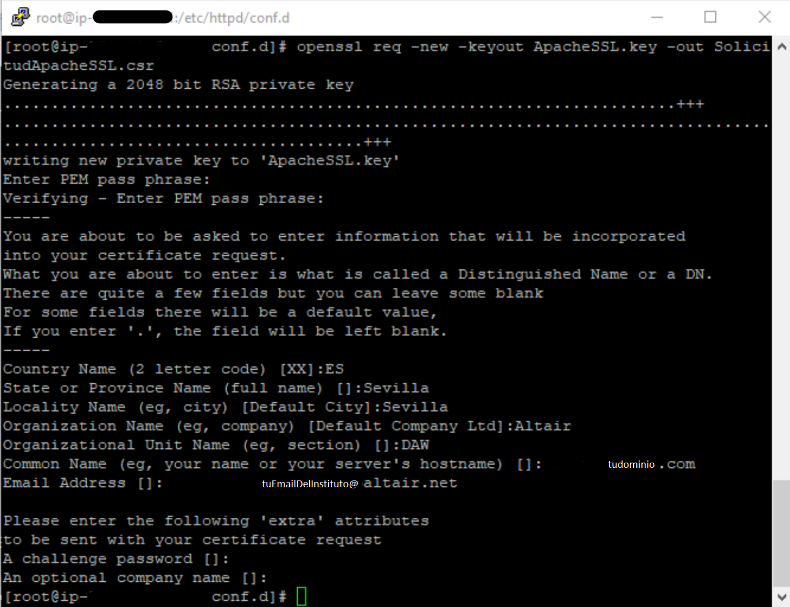

PEM pass phrase: tupassword

Y aquí estarían ya la clave privada de ApacheSSL.key y su solicitud SolicitudApacheSSL.csr

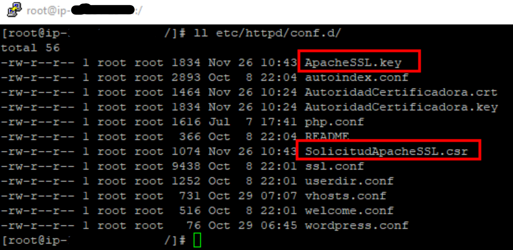

Ya solamente faltaría hacer el certificado de la solicitud, y que lo firme la Autoridad Certificadora

Video Extra 1: https://www.youtube.com/watch?v=uPNFENxL16U

Video Extra 2: https://www.youtube.com/watch?v=y97QhzWNc7M

# 3. Configuración de Apache

Nota: Hay que asegurarse de que el Apache tiene el módulo ssl. Se trata de un driver que Apache incorpora al arrancar y con el que es capaz de usar encriptación SSL.

`sudo yum install -y mod_ssl`

Nota: Si no lo instalamos … cualquiera de los parámetros de configuración SSL de Apache daría un error tipo Directiva desconocida.

La instancia tiene ahora los archivos siguientes que utiliza para configurar el servidor seguro y crear un certificado para pruebas:

- /etc/httpd/conf.d/ssl.conf

El archivo de configuración para mod_ssl. Contiene directivas que le indican a Apache donde encontrar claves de cifrado y certificados, las versiones de protocolo TLS que se permiten y los cifrados que se aceptan.

- /etc/pki/tls/certs/make-dummy-cert

Un script para generar un certificado X.509 autofirmado y una clave privada para su host de servidor. 

Este certificado es útil para probar si Apache está configurado correctamente para utilizar TLS. 

Dado que no ofrece ninguna prueba de identidad, no se debería utilizar en producción. Si se utiliza en la producción, dispara advertencias en los navegadores web.

Nota: en este punto me doy cuenta de que los dos puntos anteriores, debería haberlos hecho en la carpeta etc/httpd/conf/ y no en la carpeta etc/httpd/conf.d/, así que he movido los archivo de sitio.

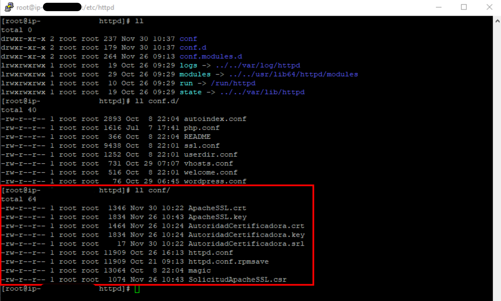

## 3.1. Archivos generados

Para que todo esto tenga efecto, le tengo que especificar al Apache, cual es cada uno de estos archivos que hemos generado.

- ApacheSSL.crt es su certificado

- ApacheSSL.key es su clave privada

- AutoridadCertificadora.crt es el certificado público de la autoridad (cualquier ordenador que tenga este certificado de autoridad, puede reconocer mi certificado)

## 3.2. httpd.conf

Vamos abrir ahora el archivo de httpd.conf (que está en este mismo directorio) y buscamos la palabra Include con :/Include

`Include conf.modules.d/*.conf`

Esta sentencia nos dice que se están importando las configuraciones de los archivos *.conf del otro directorio /conf.d/

Nos fijamos en que hay un archivo de configuración que tiene que ver con el SSL ...

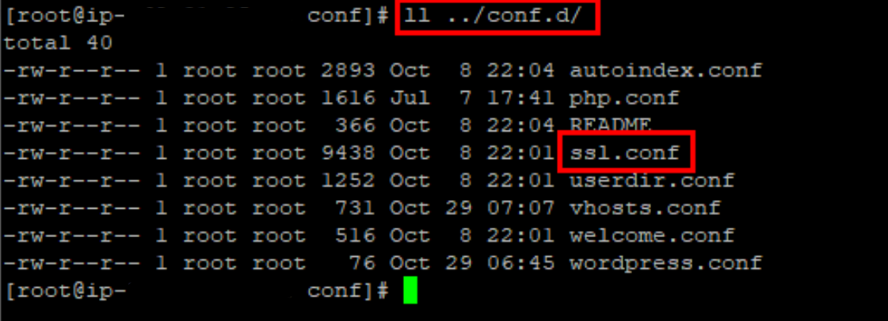

## 3.3. VirtualHost

Abrimos este archivo de ssl.conf, y buscamos donde empiece el tag de VirtualHost para realizar las siguientes modificaciones:

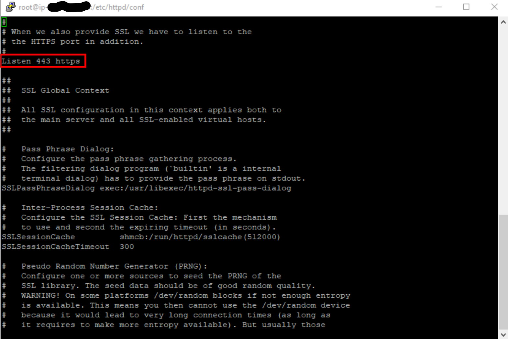

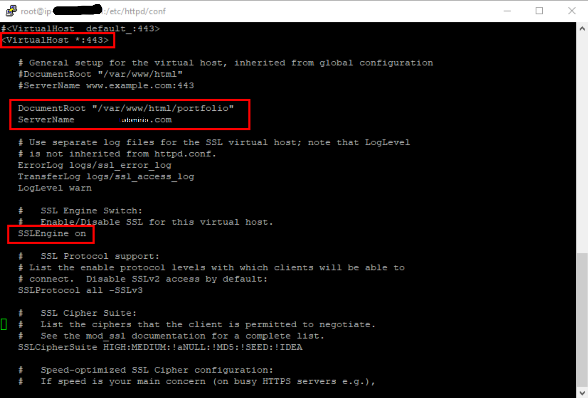

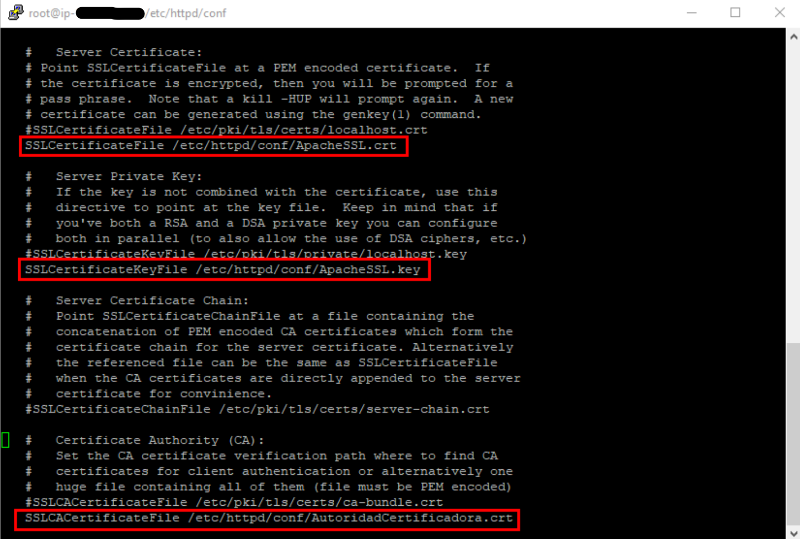

## 3.4. Resetear Apache

Si ejecutamos ahora un, `systemctl restart httpd`, vemos que me pide el passphrase de la clave privada… tupassword … y ya estaría !!

Video Extra: https://www.youtube.com/watch?v=UTu1y_geX_Y

# 4. Comportamiento de los Navegadores

Si introduzco ahora en el Chrome mi dominio tudominio.com ...

## 4.1. Firefox

Vamos a abrir nuestra web ahora en firefox, poniendo en la URL https://tudominio.com

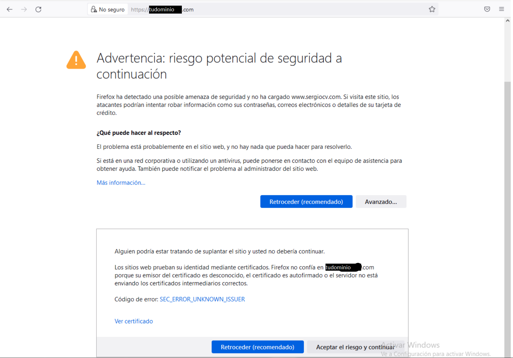

Video Extra: https://www.youtube.com/watch?v=O98FZABHSgw

## 4.1. Privacidad/Seguridad --> Certificados

Si en el Firefox, le doy a configuración, y a Privacidad/Seguridad, y bajo hasta abajo del todo hasta la parte de certificados … compruebo que nuestra AutoridadCertificadora ya está instalada (importada)

Si volvemos a poner nuestra direccion (https://tudominio.com)

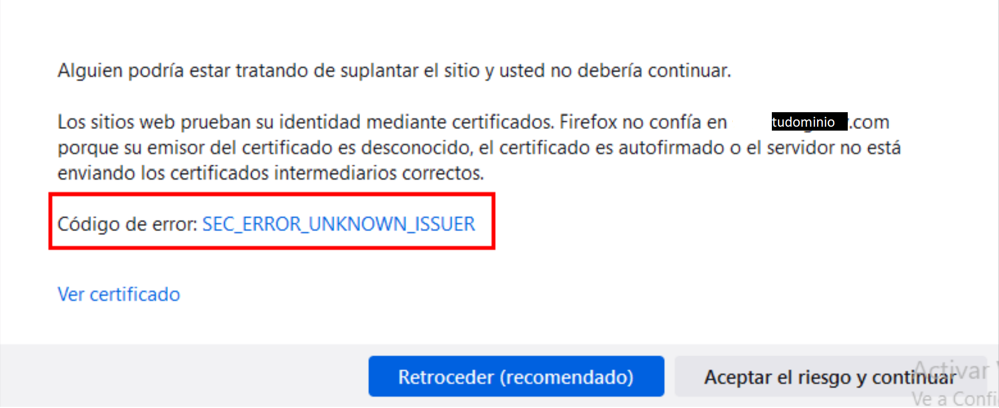

Nota: Bad certificate domain error

En este video, el profesor me ha dado a entender que haría falta un certificado por cada DNS.

Video Extra: https://www.youtube.com/watch?v=R6tGWXdVXAo

# 5. Crear certificados con SAN (Subject Alternative Name)

## 5.1. Archivos SANready y x509

Descargamos los dos archivos que el profesor nos ha dejado preparados

Abrimos el archivo SANready.cnf

## 5.2. Clave privada

Volvemos a utilizar el comando que crea la clave privada y la petición, pero esta vez, le añadimos unas opciones más ...

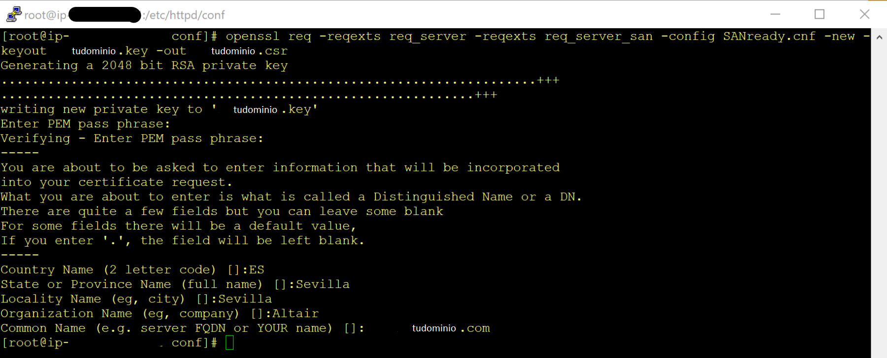

Ahora abrimos el otro archivo que descargamos (x509..) para modificar los DNS

## 5.3. Autoridad Certificadora

## 5.4. Firmamos la solicitud

Video Extra: https://www.youtube.com/watch?v=P3c0Lypp-RY

## 5.5. Propiedades de la solicitud

Para ver las propiedades de la solicitud ejecutamos el comando …

`openssl req -in tudominio.csr -noout -text -nameopt sep_multiline`

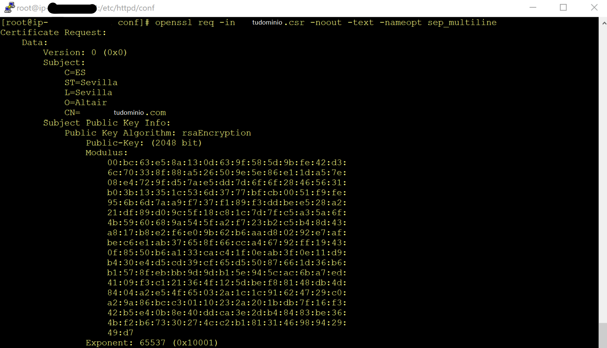
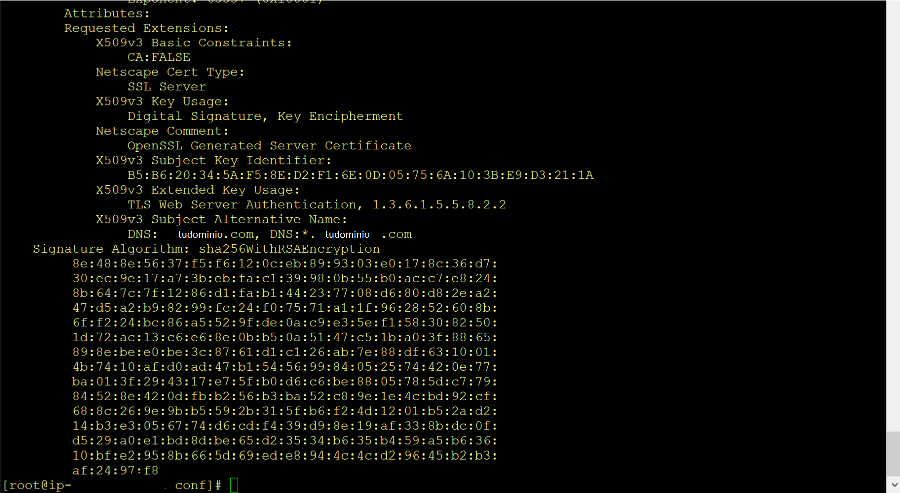

Nota: Para tenerlo finalmente tan bien ordenado como el profesor, he creado un directorio en /etc/ que se llama certs, y he movido los archivos que he ido generando hacia tal directorio … sin olvidar cambiar las direcciones de tales archivos en mi ssl.conf

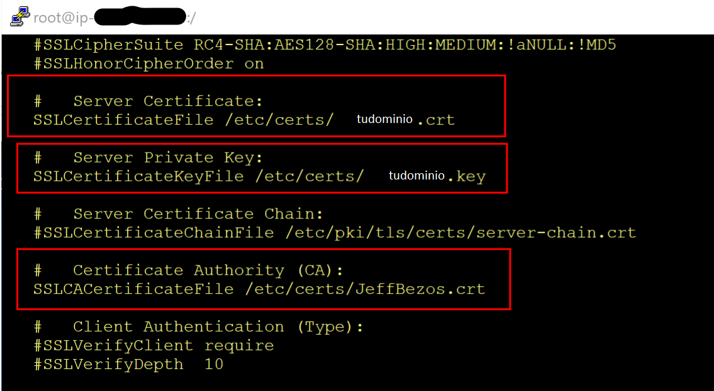

Hacemos un `systemctl restart httpd` y en el Chrome vemos que ...

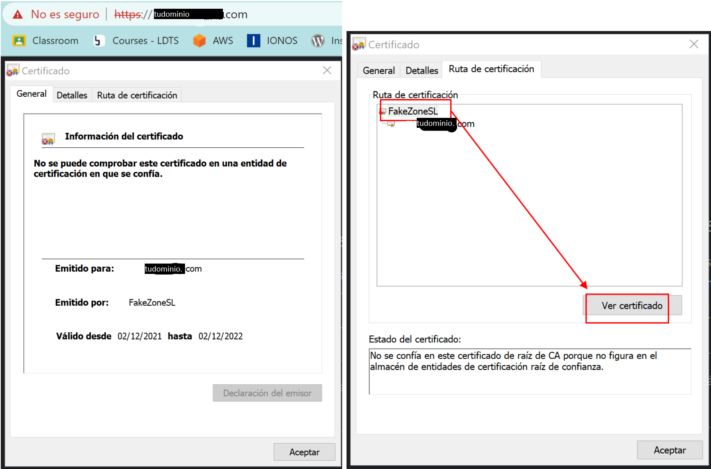

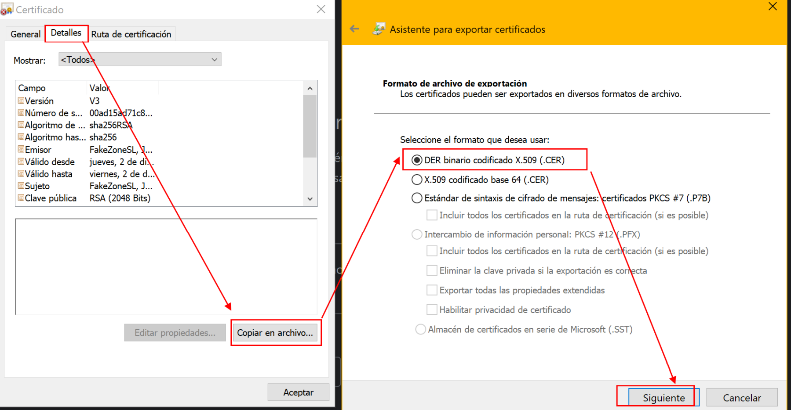

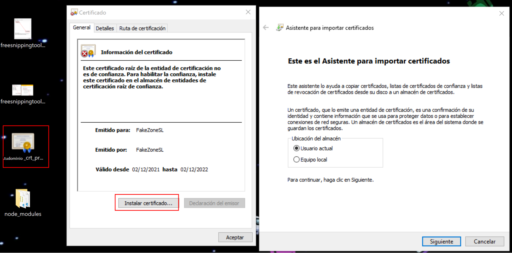

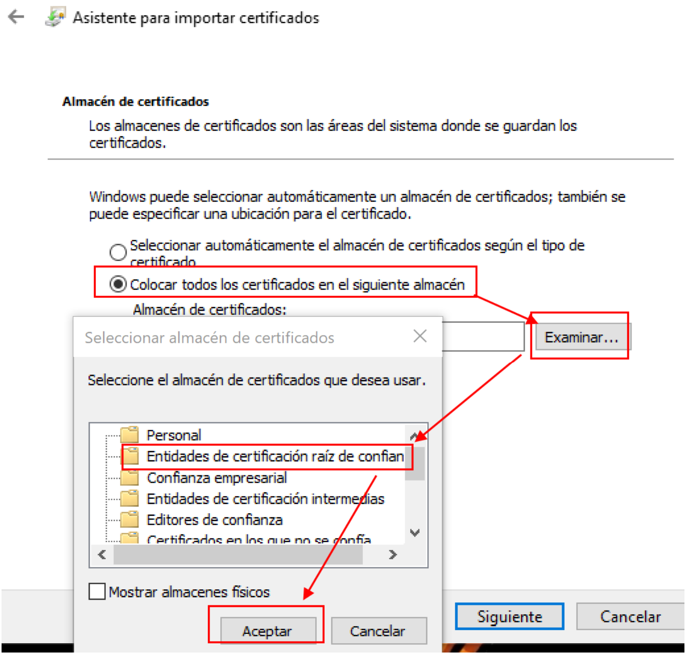

Si abrimos una nueva pestaña de incógnito en Chrome (para evitar el caché guardado), podremos ver que todo ha funcionado correctamente!!

# 6. Entrega del objetivo de Apache SSL

## 6.1. Resumen del Vhost https indicando

- servername
- document root
- archivo ssl

Dentro de /etc/httpd/conf.d/ssl.conf ...

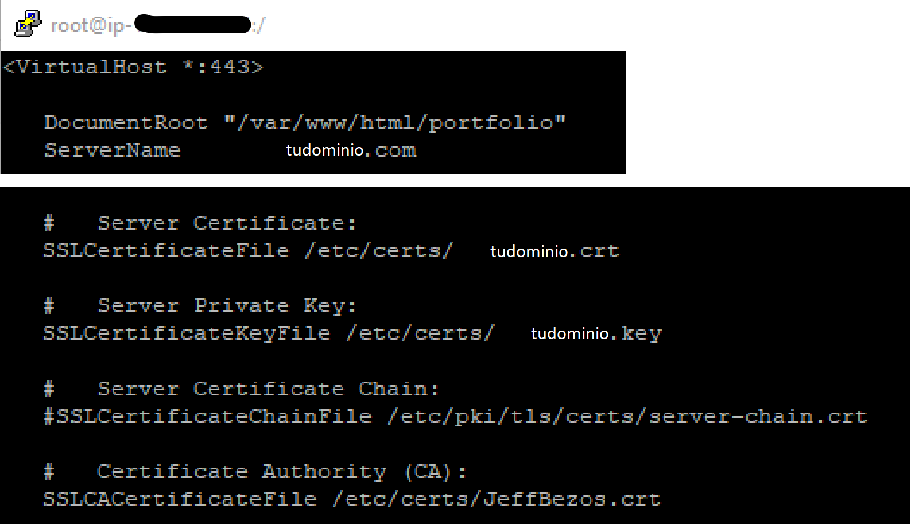

Recordar que, los archivos vienen desde …

## 6.2. Firefox

En Chrome funciona perfectamente, pero ahora me ha pedido el profesor que lo haga también a través de Firefox...

ADVERTENCIA:

- Antes para que funcionara en Chrome, al descargar la Autoridad desde la
“advertencia” de seguridad de Chrome y ejecutar tal archivo desde el escritorio, le di a instalar para “este usuario” …

- Después descargué e instalé Firefox, y al principio, al poner mi dominio (portfolio) con https:// al principio, me saltaba la advertencia de que el sitio no era seguro.

- A través de la configuración de firefox → Privacidad y Seguridad... Al comprobar las Autoridades Certificadoras de Firefox, a priori, no estaba mi Autoridad llamada FakeZone … aquí empezó un poco la confusión …

- Más tarde, intenté varias cosas, como por ejemplo, importar la CA que descargué desde Chrome en Firefox (que me saltaba el mensaje de que ya estaba instalada) …

- Cuando después volví a visitar la lista de las CAs que hay en Firefox, descubro que ahora sí que está mi CA de FakeZone, pero que por razones que desconozco, no sé por qué me lo he encontrado, dentro a su vez, de la CA de Amazon (el Amazon la empresa de verdad).

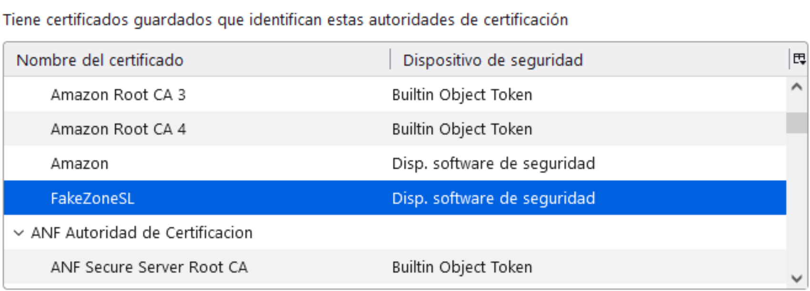

- incluso le di al botón de “Ver” para comprobar que todo estuviese correcto

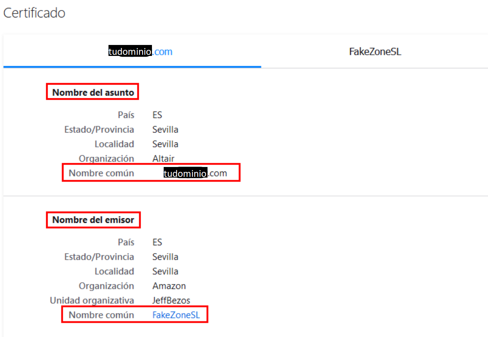

Nota: le puse de broma en la Organización, “Amazon”, pero sí que es real que es Amazon la CA que tiene dentro la mía de FakeZone

- Para que finalmente funcionase, tuve que darle al botón de “Editar” y pulsar la opción de que esta CA (la mía) pudiera reconocer sitios web (resulta que esta traducción de Firefox al español está mal traducida y por eso no la había visto bien antes...)

Nota: No borrar el historial, tan sólo reiniciar Firefox, y ya sí funciona el https:// en Firefox también.

### ACLARACIÓN FINAL 1:

Para que funcionase en firefox, lo que tuve que hacer, a modo resumen es, ir a la configuración de firefox, al apartado de Privacidad y Seguridad…

Comprobamos que efectivamente, nuestra Autoridad Certificadora de FakeZone aún no aparece entre las CA existentes ya en la lista…

Así que le doy a importar, selecciono el archivo que previamente descargamos de Chrome (tudominio.cer) …

En el nuevo cuadro de diálogo que nos sale, marcamos la opción de que esta CA nuestra pueda identificar sitios web, y le damos a aceptar…

Cerramos firefox, entramos, (opcionalmente comprobamos que nuestra CA (FakeZone) ya se encuentra entre las otra CA de la lista, y ponemos en el buscador https://tudominio.com y … funcionó !! sale el candado !!

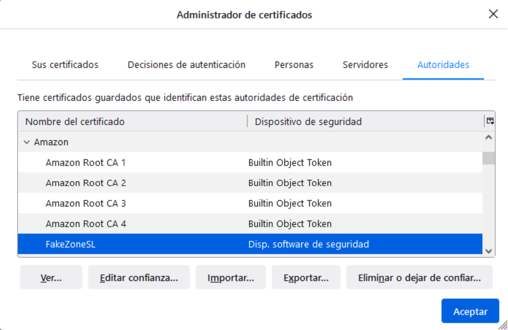

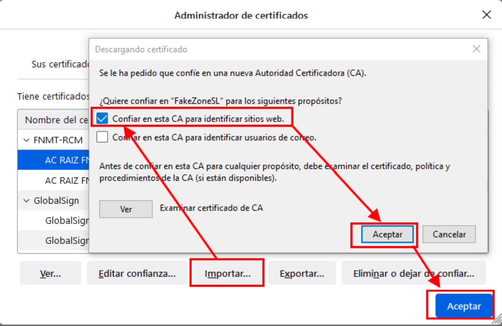

### ACLARACIÓN FINAL 2:

En Chrome, para importar la CA, aunque no lo hayamos visto así, pero sería …

Yendo a la configuración → Privacidad y Seguridad → Seguridad → Gestionar Certificados

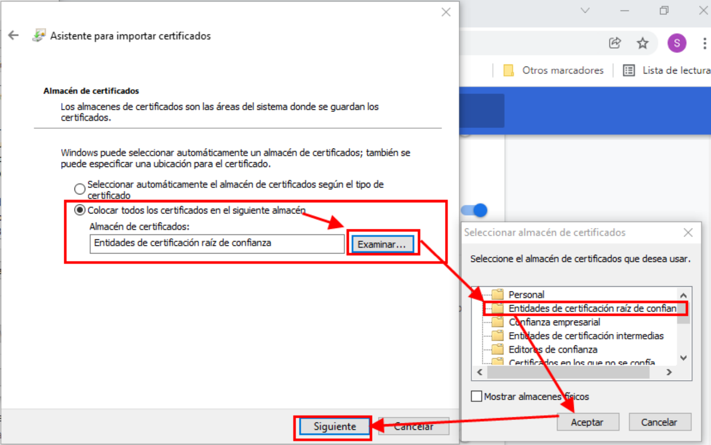

Nota: Por último, el profesor me pregunta que cuáles son los archivos que indico en el vHost del SSL …

- tudominio.crt es mi certificado
- tudominio.key es mi clave privada
- JeffBezos.crt es el certificado público de la autoridad (cualquier ordenador que tenga este certificado de autoridad, puede reconocer mi certificado)
