# Tabla de Contenidos

<!-- TOC -->

- [Firma Digital](#firma-digital)

- [Objetivo 1: Firma digital falsa](#objetivo-1-firma-digital-falsa)
- [1. Creación de Certificados y Autoridades parte 2](#creaci%C3%B3n-de-certificados-y-autoridades-parte-2)
    - [1.1. Introducción](#introducci%C3%B3n)
    - [1.2. Crear una Autoridad Certificadora](#crear-una-autoridad-certificadora)
    - [1.3. Crear una Solicitud de Certificado](#crear-una-solicitud-de-certificado)
    - [1.4. Cómo firma la Autoridad una Solicitud](#c%C3%B3mo-firma-la-autoridad-una-solicitud)
    - [1.5. Comando final](#comando-final)
    - [1.6. Instalar el certificado](#instalar-el-certificado)
- [2. Firmar un documento con Autofirma](#firmar-un-documento-con-autofirma)
    - [2.1. Instalar Autofirma](#instalar-autofirma)
    - [2.2. Firmamos un documento PDF](#firmamos-un-documento-pdf)
    - [2.3. Extra: Extensiones de archivos más usadas](#extra-extensiones-de-archivos-m%C3%A1s-usadas)
    - [2.4. Extra: Autofirmar una Solicitud](#extra-autofirmar-una-solicitud)
    - [2.5. Extra: Firma Digital](#extra-firma-digital)
- [Objetivo 2: Firma digital del Gobierno](#objetivo-2-firma-digital-del-gobierno)
- [3. Firma Digital del Gobierno persona física - FNMT](#firma-digital-del-gobierno-persona-f%C3%ADsica---fnmt)
    - [3.1. Empezar el proceso de adquisición del certificado digital](#empezar-el-proceso-de-adquisici%C3%B3n-del-certificado-digital)
    - [3.2. Obtener Certificado software](#obtener-certificado-software)
        - [3.2.1. Configuración previa.](#configuraci%C3%B3n-previa)
        - [3.2.2. Solicitud vía internet de su Certificado.](#solicitud-v%C3%ADa-internet-de-su-certificado)
        - [3.2.3. Acreditación de la identidad en una oficina.](#acreditaci%C3%B3n-de-la-identidad-en-una-oficina)
        - [3.2.4. Descarga de su Certificado de Usuario.](#descarga-de-su-certificado-de-usuario)
    - [3.3. Descarga del certificado digital, instalación y consulta](#descarga-del-certificado-digital-instalaci%C3%B3n-y-consulta)
    - [3.4. Firmar un documento digitalmente](#firmar-un-documento-digitalmente)

<!-- /TOC -->

# Firma Digital

Esta última parte del curso, se subdivide a su vez en dos objetivos. El primer objetivo será realizar una firma digital, volviendo a utilizar previamente los comandos del tema de ApacheSSL, que nos permitían crear solicitudes de certificados y autoridades certificadoras (entre otras cosas)... y por otro lado, el segundo objetivo tratará igualmente sobre realizar una firma digital, pero esta vez, certificada por una autoridad real, que en nuestro caso, tendremos que tener preparada de antemano la certificación y acreditación ante el Estado (nuestra Administración Pública) de nuestra persona física, dirigiéndonos para ello a alguna de las oficinas pertinentes para ello.

# Objetivo 1: Firma digital (falsa)

# 1. Creación de Certificados y Autoridades (parte 2)

## 1.1. Introducción

He terminado el título de este objetivo especificando “parte 2” porque ya en su momento tratamos este tema, cuando creamos la autoridad certificadora (CA) y la solicitud, e instalamos en el navegador aquel certificado de “mentirijilla” que certificaba nuestro dominio...

**Nota**: todo esto ya lo realizamos en el pasado objetivo de ApacheSSL.

E incluso después de ello, volvimos a repetir el mismo proceso, pero ya de verdad, con el certificado real de IONOS y así obtuvimos aquella primera verificación real de seguridad (NginxSSL) en nuestro dominio...

Ahora, volvemos a repetir parte de aquel proceso para volver a generar una CA y una solicitud “falsa”, pero esta vez, con el objetivo de firmar un documento (un PDF por ejemplo) y hacerle saber a nuestro receptor que, el documento que ha recibido es auténtico y original.

## 1.2. Crear una Autoridad Certificadora

Creamos nosotros mismos un certificado de autoridad de confianza para firmar el certificado del servidor.

Primero creamos el certificado de la autoridad de confianza (clave pública) y su clave (privada) con el siguiente comando:

`openssl req -x509 -newkey rsa:4096 -keyout LasDunasCamell.key -days 365 -out LasDunasCamell.crt`

- **newKey**: Sirve para decirle que cree una nueva clave privada. rsa:2048 se refiere al modo de encriptación.
- **keyout**: Archivo de salida de la clave privada generada.
- **days**: Días de duración de la clave en este caso su duración será de 365 dias.

Para la clave privada nos pedirá un *passphrase*. Ese passphrase se pedirá cada vez que la clave privada se use para firmar.

También debemos rellenar los datos de identificación de la empresa que irán en el certificado (*clave pública*)

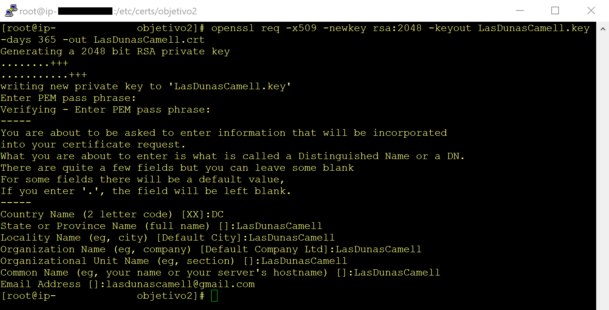

## 1.3. Crear una Solicitud de Certificado

Queremos un certificado digital para nuestro servidor web, por lo que necesitamos una clave privada y un certificado o clave pública.

La clave privada la creamos nosotros, pero la pública, el certificado, necesitamos que esté avalado (firmado) por alguien reconocido; no hacemos el certificado, sino que le enviamos una solicitud a la famosa *LasDunasCamell™*.

Por lo tanto, ahora lo que hacemos es crear la clave privada y la solicitud (del individuo):

`openssl req -new -keyout royal.key -out royal.csr`

- **new**: instrucción openssl que permite crear un nuevo certificado.
- Los **“out”**: son los 2 archivos que va a crear: la solicitud y la clave privada asociada a la solicitud.

Al ejecutar el comando nos pedirá un passphrase para la clave privada (.key). Ese passphrase hará falta cada vez que se use la clave privada. Después, preguntará los datos que querremos tener en el certificado.

Por un lado, tenemos una clave privada y una solicitud de certificado. Ahora nos falta el certificado en sí (clave pública). Una vez que tengamos el certificado, la solicitud podemos desecharla.

Pero ¿cómo conseguimos ese certificado? Muy fácil: sólo hay que pagar a una Autoridad Certificadora para que firme nuestra solicitud y nos devuelva el correspondiente certificado firmado.

Por otro lado, habíamos creado justo antes una Autoridad Certificadora. Luego en vez de pagarle a nadie podemos acudir a nuestra propia autoridad y pedirle que nos firme la solicitud, generando así el certificado firmado.

## 1.4. Cómo firma la Autoridad una Solicitud

Ahora de nuevo somos *LasDunasCamell™*

Resulta que nos ha llegado una solicitud de una empresa española llamada *Royal SL*. En concreto solicitan un certificado firmado y avalado por nuestra marca para el dominio DNS *LasDunasCamell.com*

Así es que, una vez que hemos asegurado que han pagado, ejecutamos el comando:

`openssl x509 -req -days 365 -CA LasDunasCamell.crt -CAkey LasDunasCamell.key -CAcreateserial -in royal.csr -out royal.crt`

- **CAkey**: Clave privada de la Autoridad Certificadora, con la que se firma la solicitud.
- **in**: que solicitud va a firmar.
- **out**: archivo de salida, puede ser de tipo cer, crt, cert entre otros.

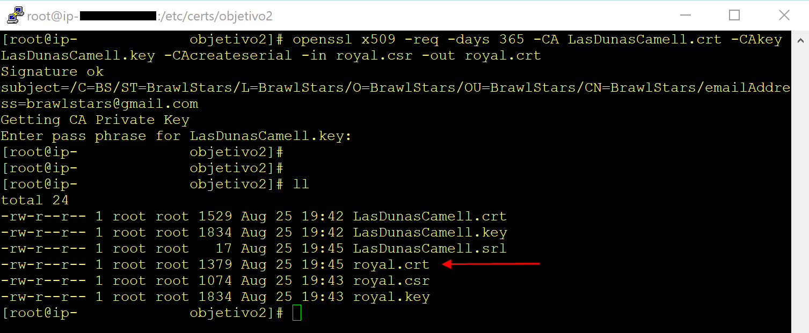

En el ejemplo declaramos la validez del certificado que vamos a crear es 365 días.

Si dentro de un año quiere renovar el certificado, volvemos a ejecutar el comando... y volvemos a cobrarle.

Al ejecutar nos pedirá la passphrase de la clave privada (LasDunasCamell.key). Con esto tendremos nuestro certificado firmado (royal.crt) firmado por *LasDunasCamell™*.

## 1.5. Comando final

Este sería el "nuevo paso final" para generar correctamente nuestro certificado y firmar documentos digitalmente.

El comando que yo usé erróneamente la primera vez, fue el que recoge la clave pública(1) y privada(2) de la autoridad certificadora, y la solicitud(3) del individuo, empaquetando todo y generando un archivo .crt:

`openssl x509 -req -days 365 -CA LasDunasCamell.crt -CAkey LasDunasCamell.key -CAcreateserial -in royal.csr -out royal.crt`

Pero el comando que realmente necesito para que todo esto funcione bien, es aquel que recoge los tres elementos clave, es decir, la **clave privada del individuo**(1), la **clave pública del individuo**(2), y la **clave pública de la autoridad certificadora**(3), y los empaqueta **generando como resultado un archivo .p12**:

`openssl pkcs12 -export -out royal.p12 -inkey royal.key -in royal.crt -chain -CAfile LasDunasCamell.crt`

**Nota**: en este caso, con la *clave pública* del individuo nos referimos al certificado de éste, cuando en el apartado anterior, la Autoridad Certificadora firmó su solicitud, generando así el archivo *royal.crt*

Y ahora, ese nuevo archivo generado de *“royal.p12”*, lo saco del servidor hacia mi ordenador con la ayuda de FileZilla.

Para una visión más detallada de esto, véase el apartado *"2.5. Extra: Firma Digital"*

## 1.6. Instalar el certificado

Instalamos el certificado *“royal.p12”* en el usuario actual de nuestro ordenador:

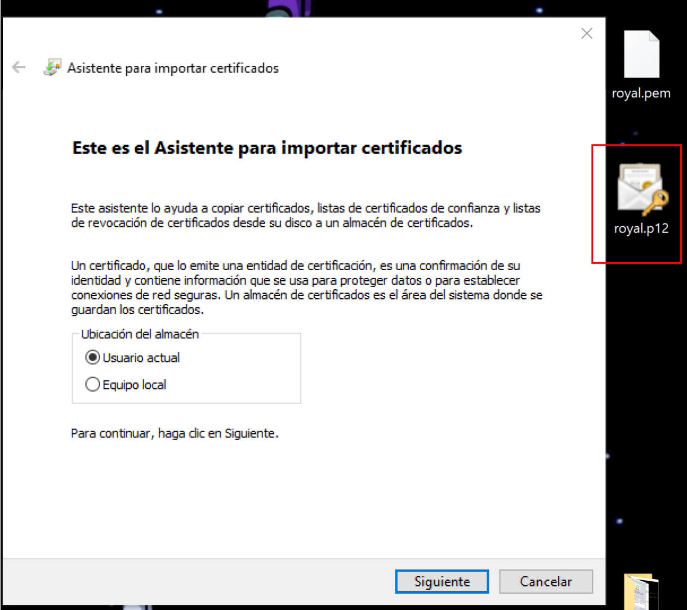

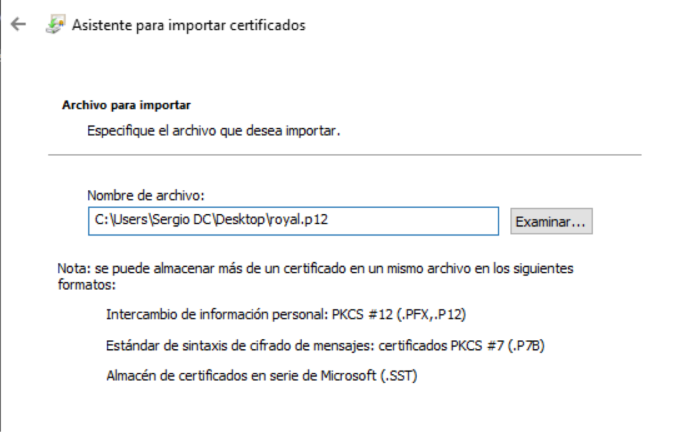

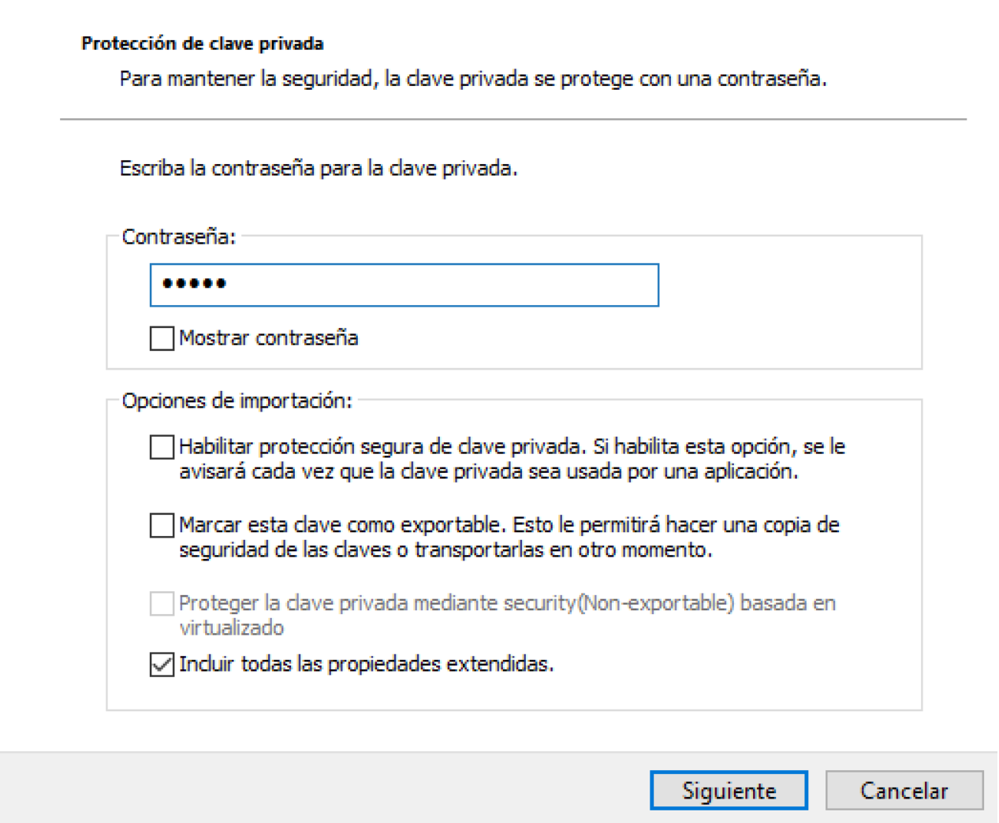

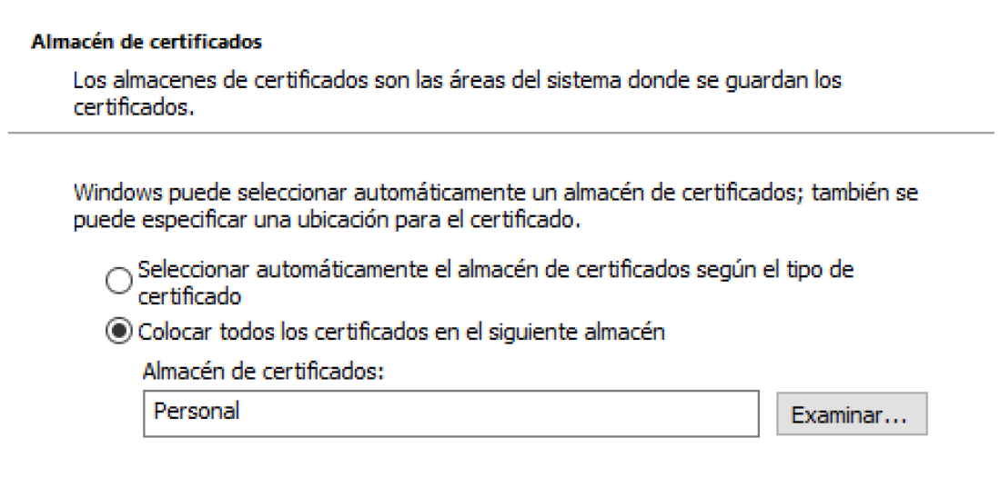

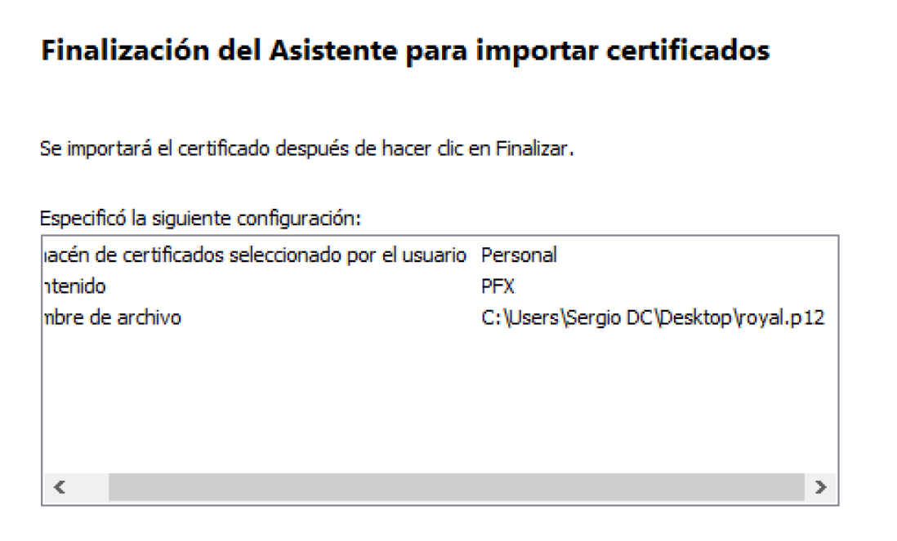

# 2. Firmar un documento con Autofirma

## 2.1. Instalar Autofirma

Instalamos el programa de Autofirma del Gobierno de España: https://firmaelectronica.gob.es/

## 2.2. Firmamos un documento PDF

**Nota**: partimos de que previamente tenemos preparado un PDF sencillo cualquiera para hacer la prueba de la firma.

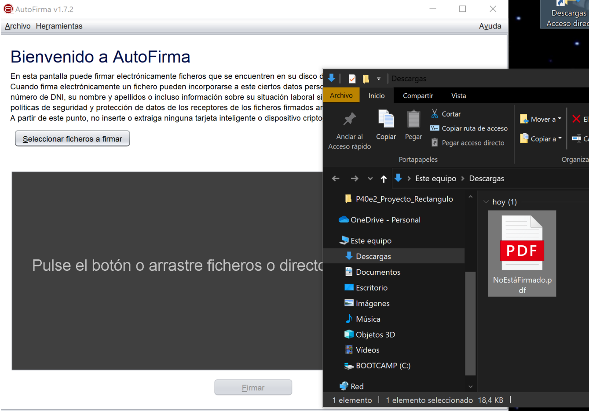

**Nota**: Opcionalmente, podemos añadir una imagen como firma estampada.

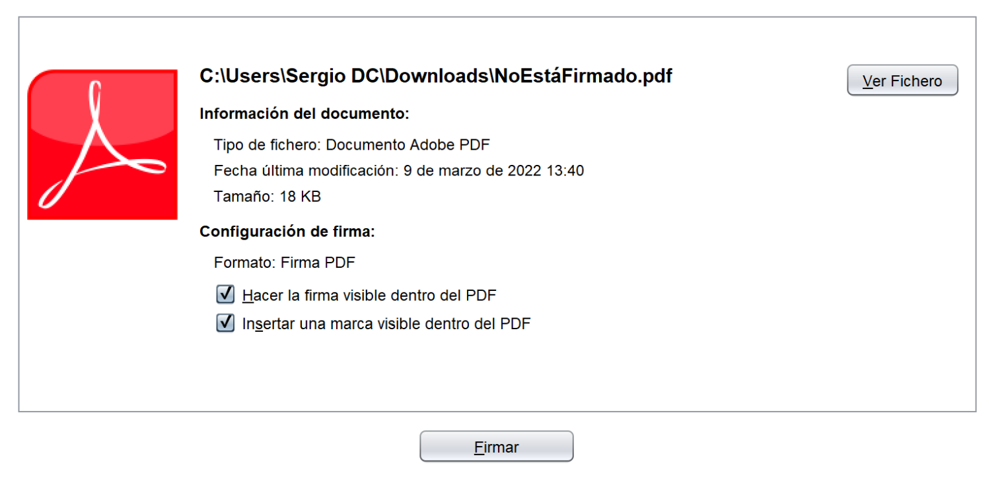

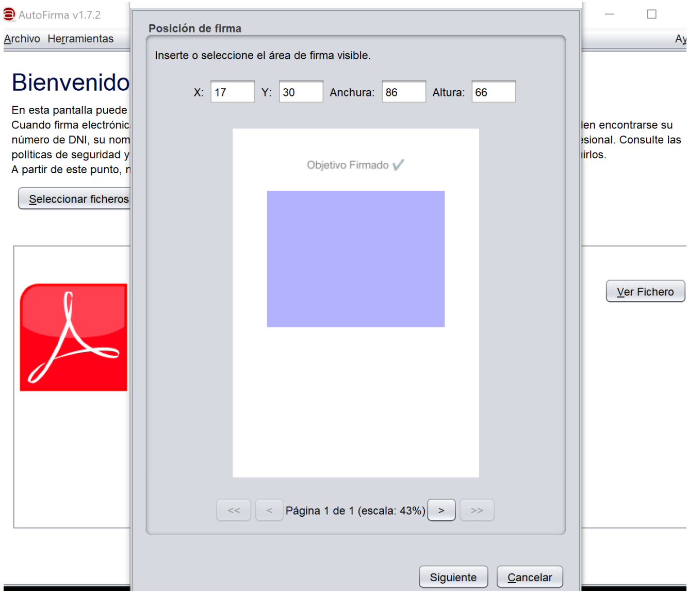

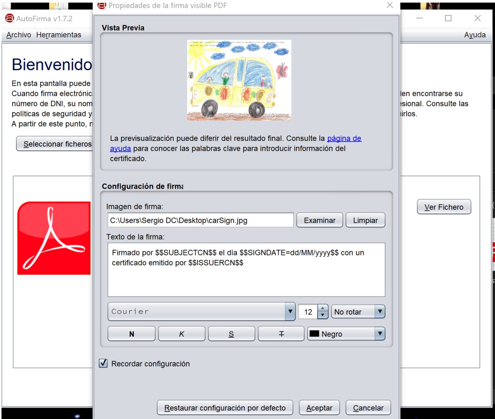

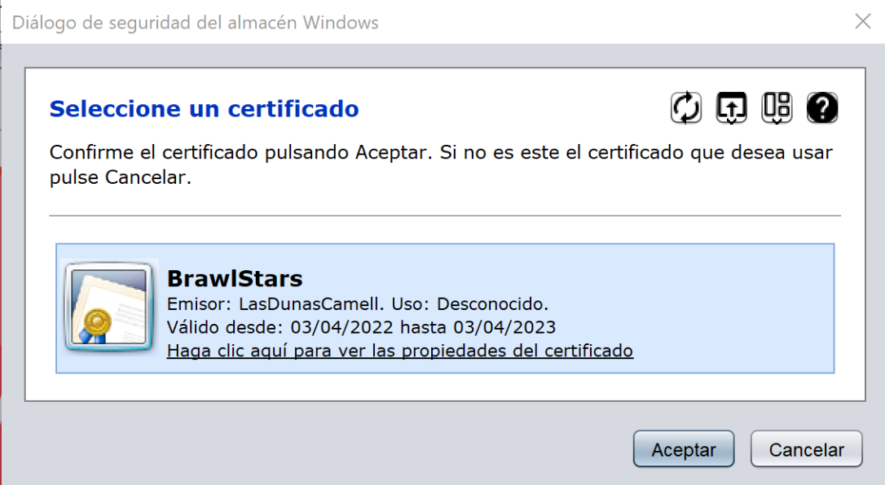

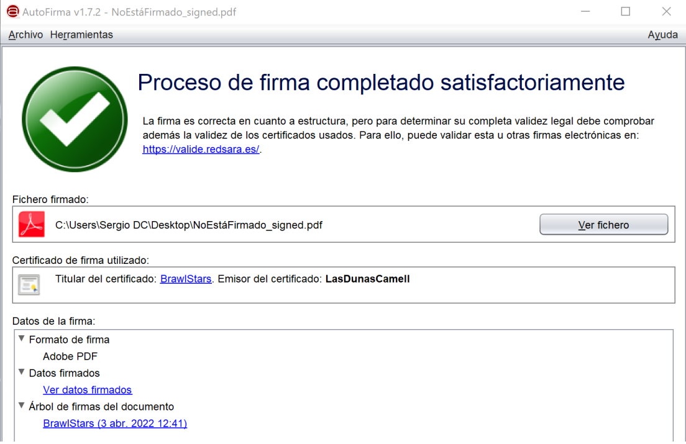

Ahora ya sólo tenemos que comprobar con algún programa de Adobe (Reader o Acrobat) si se ha realizado la firma correctamente, es decir, abrir Adobe, y dentro de él, abrir el documento que hemos firmado, y ver en sus propiedades y detalles si se reconoce efectivamente la firma como válida (tiene que salir un tick en verde, no valdría el triángulo de warning en amarillo).

**Nota**: en este punto, quizás es conveniente recordar el video del profesor acerca de *"el comportamiento de los navegadores"*: https://www.youtube.com/watch?v=O98FZABHSgw

Debemos saber y tener muy claro antes de presentarnos a la prueba final del profesor que, el certificado firmado que nosotros hemos creado en nuestro servidor Linux es falso, es decir, la CA con la que lo firmamos era también falsa, ya que la creamos nosotros mismos, y por lo tanto, esa CA no está reconocida por ningún navegador, y es por ello por lo que debemos instalar nosotros mismos y manualmente nuestro certificado "falso" en nuestro ordenador y en nuestro navegador, para que éstos lo reconozcan y poder así efectuar la firma en un documento pdf correctamente.

## 2.3. Extra: Extensiones de archivos más usadas

SSL cuenta con diversos formatos a usar de archivos, estos son los más utilizados:

- **.csr**: Certificate Signing Request. Algunas aplicaciones pueden generar esto por sumisión a las unidades certificadoras. Incluye algunos/todos los detalles de la clave del certificado requerido como sujeto, organización, estado, junto con la clave pública del certificado para ser firmada. Estos son firmados por la CA y devuelven un certificado.

- **.pem**: Definido en RFC’s 1421 en1424, es un formato contenedor que puede incluir solo el certificado publico (como en la instalación de apache, y CA certificate files /etc/ssl/certs), o puede incluir una cadena completa certificadora incluyendo llave pública, privada y certificados raíz. Su nombre es por Privacy Enhanced Email,un método fallido de email seguro pero su contenedor sigue en uso.

- **.key**: Esta es un archivo formateado PEM que contiene solo la llave privada de un certificado específico. En instalaciones Apache, está frecuentemente reside en /etc/ssl/private.Los derechos de su directorio y certificado son muy importantes y algunos programas no lo cargaran si están mal.

- **.pkcs12 .pfx .p12**: Definidos Public-Key Cryptography Standards, la variable “12” fue encadenada por Microsoft. Esto es un contenedor de contraseñas que contiene ambas claves, pública y privada. A diferencia de los archivos .pem, este contenedor está completamente encriptado.

- **.der**: Un modo de codificar ASN.1 sintaxis, un archivo .pem solo tiene Base64 codificacion archivo .der. OpenSSL puede convertir esto a .pem.

- **.cert .cer**: Un formato .pem con diferente extensión, Es reconocido por windows como certificado, mientras .pem no.

- **.crl**: Lista de revocación de certificados. Las autoridades las producen como un modo de desautorizar certificados después de su expiración.

## 2.4. Extra: Autofirmar una Solicitud

Esta es la opción más sencilla, y con ella conseguiremos firmar el certificado sin necesidad de una autoridad certificadora. 

Se trata de una firma que no está avalada por nadie más que por ella misma.

En este caso crearíamos una clave privada y una solicitud.

`openssl req -new -keyout royal.key -out royal.csr`

Una vez hecho esto, esa solicitud la firmamos con la propia clave privada, sin acudir a ninguna autoridad. Lo hacemos así:

`openssl x509 -req -days 365 -in royal.csr -signkey royal.key -out royal.crt`

La opción *-signkey* es la que se encarga de que la clave privada royal.key firme la solicitud .csr previamente creada. Para ello, lógicamente, pedirá el passphrase de esa clave privada.

## 2.5. Extra: Firma Digital

Cuando hablamos de Firma Digital estamos diciendo lo mismo que con Certificados Digitales cambiando sólo un detalle: No se trata de identificar un dominio DNS, sino una **persona física con nombre y apellidos o una persona jurídica con razón social**.

Por lo tanto, el procedimiento es igual al procedimiento de certificado firmado por una autoridad (en el mundo real), la autoridad será una entidad pública dirigida por el gobierno del país que sea, como la Fábrica Nacional de Moneda y Timbre (FNMT).

¿Qué hay que cambiar? Esencialmente el Common Name de la solicitud...

En el paso 2, al crear la solicitud, pusimos los siguientes datos:

*`openssl req -new -keyout royal.key -out royal.csr`*

Ahora, en cambio, en el Common Name, podríamos poner nuestro nombre y apellidos...

Una vez hecha la solicitud, se le da a la autoridad certificadora para que la firme y nos devuelva el certificado firmado.

Por último, y siempre en el caso de la firma, tenemos que “empaquetar” 3 elementos en un archivo PKCS o equivalente. Los 3 elementos en cuestión son:

- La clave privada del individuo (.key)
- La clave pública del individuo (el certificado firmado .crt)
- La clave pública de la autoridad que ha firmado (.crt de la autoridad)

Y esto se hace con el siguiente comando:

`openssl pkcs12 -export -out firmadigital.p12 -inkey privada.key -in publica crt -chain -CAfile ca.crt`

El resultado es el archivo **firmadigital.p12** que se puede instalar en cualquier ordenador para firmar documentos o correos electrónicos.

# Objetivo 2: Firma digital del Gobierno

# 3. Firma Digital del Gobierno (persona física) - FNMT

## 3.1. Empezar el proceso de adquisición del certificado digital

Puedes encontrar toda la información acerca del Certificado Digital del Gobierno para Personas Físicas en el siguiente enlace que te dejo a continuación, siendo también éste el punto de partida para conseguir el certificado digital. 

https://www.sede.fnmt.gob.es/certificados/persona-fisica/obtener-certificado-software

## 3.2. Obtener Certificado software

El proceso de obtención del Certificado software (como archivo descargable) de usuario, se divide en cuatro pasos que deben realizarse en el orden señalado:

### 3.2.1. Configuración previa. 

Para solicitar el certificado es necesario instalar el software que se indica en este apartado.

### 3.2.2. Solicitud vía internet de su Certificado. 

Al finalizar el proceso de solicitud, usted recibirá en su cuenta de correo electrónico un Código de Solicitud que le será requerido en el momento de acreditar su identidad y posteriormente a la hora de descargar su certificado.

### 3.2.3. Acreditación de la identidad en una oficina. 

Una vez completada la fase anterior y esté en posesión de su Código de Solicitud, para continuar con el proceso deberá Acreditar su Identidad en una de las Oficinas de Acreditación de Identidad.

Servicio de Localizador de Oficinas: http://mapaoficinascert.appspot.com/

**Nota**: en las oficinas de la AEAT, Seguridad Social y en otras oficinas se requiere de cita previa, de modo que consulte con la propia oficina.

### 3.2.4. Descarga de su Certificado de Usuario. 

Aproximadamente una hora después de que haya acreditado su identidad en una Oficina de Acreditación de Identidad y haciendo uso de su Código de Solicitud, podrá descargar e instalar su certificado y realizar una copia de seguridad, desde el siguiente enlace: https://www.sede.fnmt.gob.es/certificados/persona-fisica/obtener-certificado-software/descargar-certificado

## 3.3. Descarga del certificado digital, instalación y consulta

**Nota**: tras descargarlo, se instala solo automáticamente.

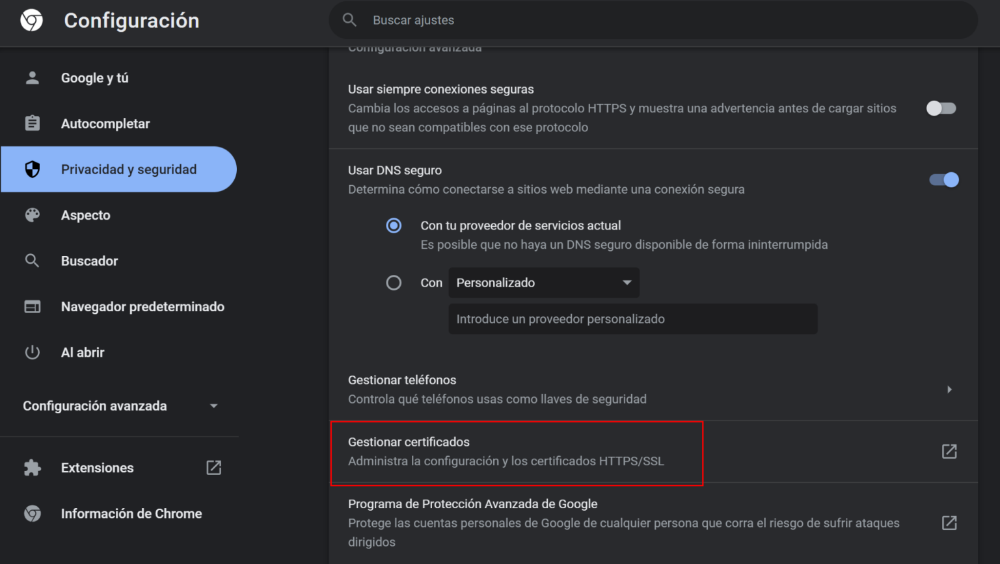

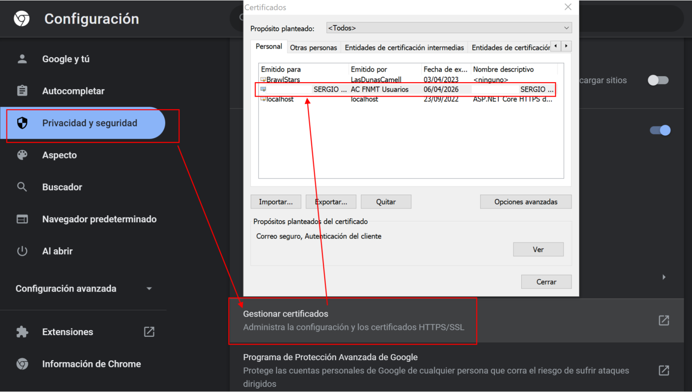

## 3.4. Firmar un documento digitalmente

Al igual que hicimos al final del primer objetivo con la firma digital "falsa", volvemos a preparar previamente un documento pdf sencillo, y lo firmamos digitalmente con el programa de AutoFirma, pero esta vez, eligiendo nuestra firma real certificada por el Gobierno (FNMT).

Le enviamos este nuevo documento firmado al profesor por email, y ya habríamos logrado también este objetivo.